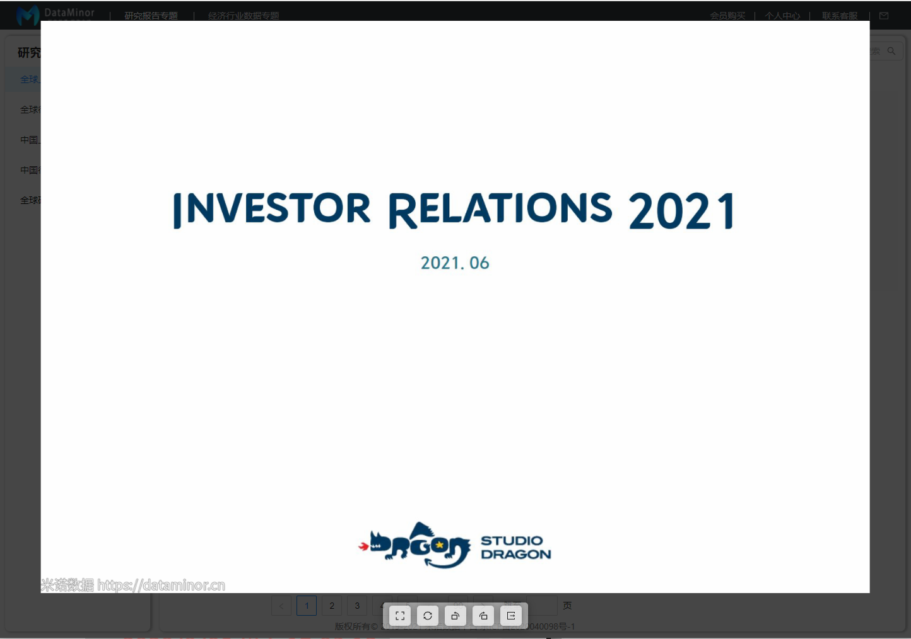

# vue-image-preview

> 在网上没找到和我心意的图片预览模块，自己做了一个，使用简单方便只有一个api，一个事件，避免了复杂的文档和使用教程
>
> 依赖于[screenfull](https://www.npmjs.com/package/screenfull)，会自动安装
>
> 项目地址：[github](https://github.com/kakioff/vueModule/tree/main/imgShow)

### 安装：`npm i vue-image-preview`

#### 功能

- 全屏预览，复位，左右旋转

- 鼠标滚轮放大缩小
- 鼠标拖动移动位置
- 双击进入和退出全屏预览
- 点击空白位置退出(调用@close事件)
- ESC键退出(调用@close事件)
- 缩放最小150px左右，最大5000px左右

#### 预览

> 如看不到图片，可前往我的[github](https://github.com/kakioff/vueModule/tree/main/imgShow)仓库查看

默认效果：

全屏效果：

#### api

- :src 图片链接，或base64数据

#### 事件

- @close 关闭事件

email: [1636700244@qq.com](mailto:1636700244@qq.com)
